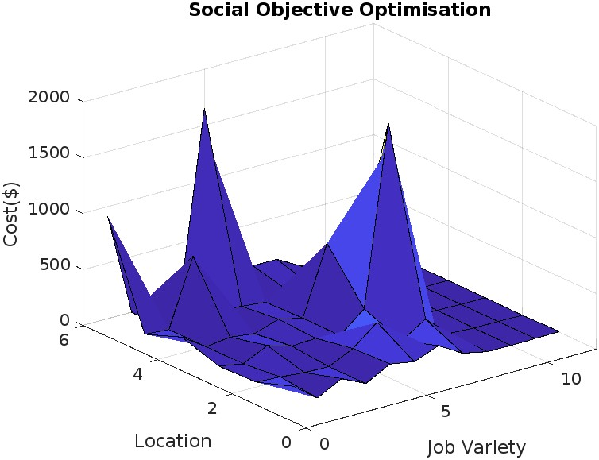

# Energy Optimization Code

## Authors
- R.A Amokun
- Engr. K. Ogunrewo

## Overview
This code implements an energy optimization model that aims to minimize environmental impact while maximizing social benefits. It considers various factors including costs of farmland, production, and consumer demands at different locations.

The code is divided into four main parts, each focusing on a different objective function:

1. **Environmental Cost Optimization (z2)**
   - Objective: Minimize the minimum land cost.
   - Input: Cost of farmland for each feedstock in each location, production, and consumer demands.
   - Output: Optimal solution and cost.

2. **Social Objective Optimization (z3)**
   - Objective:Minimize Labour Cost.
   - Input: Costs and availability of farmland, plantland, and storage.
   - Output: Optimal solution and cost.

3.**Economic Objective Optimization (z1)**
   Objective: Minimize the minimum land cost.
   - Input: Cost of farmland for each feedstock in each location, production, and consumer demands, Transport Cost, Miscellaneous cost and Land Cost
   - Output: Optimal solution and cost.

4. **Labour Objective Optimization (z3)**
   - Objective: Maximize job creation.
   - Input: Costs and availability of farmland, plantland, and storage.
   - Output: Optimal solution and cost.
  
5. **Resilency Objective Optimization (z3)**
   - Objective: Minimize Cost by Nodal Analysis.
   - Input: Node values.
   - Output: Optimal solution and cost.

## Usage
1. Each section of the code can be run independently to perform the optimization for the respective objective function.
2. The code is written in MATLAB, and each section contains detailed comments to explain the logic and computations.

## Sensitivity Analysis
- The code includes sensitivity analysis for each objective function, which helps in understanding the impact of perturbations on the optimal solutions.

## Authors' Contact Information
- R.A Amokun: [amokunridwan@gmail.com]
- Engr. K. Ogunrewo: [rewoking2008@yahoo.com]

